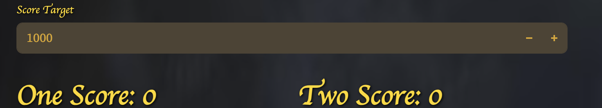

# Dice From Kingdom Come Deliverance 2
The Game of Dice from KCD2 but this let you play that with real dice. Useses a YOLOv12 powered object detection model that can detecte the face values of your rolled dices and calculates your scores dynamically baed on your score selection. 
## Installation

1) Clone this Repository
2) Make your virtual environment
`python -m venv venv`
    * Linux `source venv/bin/activate`
    * Windows `venv\Scripts\activate`
3) Install python dependencies 
`pip install -r requirements.txt`
4) `cd Streamlit`
5) Make sure by running below code seperately that the application can access your phones camera or camera source that can point to the dice for mac both phone and laptop should be on the same aple account
- `imoprt cv2`
- `cap = cv2.VideoCapture(1)` 

6) Run the streamlit using `streamlit run app.py`

## Gameplay
1) Start with selecting the game name this will create a new `<game_name>.pkl` file in the `./games` directory. To start a new game either delete the file or put in a new game name.

2) Select Target Score for the game.

3) Roll your dice and check Enable capture
 

4) This will open up a live object detection panel where the model will detect the rolled dice and its number live. 

5) Remove the dice you dont want for score and once the remaining dice is correctly detected disable capture

6) Your selected dice value and consequent score will be displayed 

7) From here you can select next roll to roll again or pass to pass on to your opponent

    * If passed the score will be added to the selected players current turn score 
    
    * On passing your score from the current Turn score + selected dice score will be passed to the selected players total socre
    

